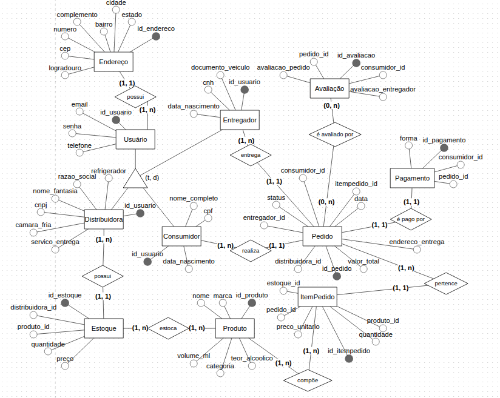

# Modelagem do banco de dados do aplicativo Zé Delivery


O Zé Delivery é um aplicativo brasileiro, criado pela empresa de bebidas AmBev, de entrega de bebidas, em que um consumidor realiza um pedido que será atendido por alguma distribuidora autorizada pela AmBev mais próxima ao endereço de entega do consumidor. O aplicativo é disponível para Android e IOS e só permite usuários a partir de 18 anos, por possuir um extenso catálogo de bebidas alcoólicas.

## Sistema escolhido
A modelagem do banco de dados do aplicativo **Zé Delivery** é componente da avaliação final da disciplina Banco de Dados I, ministrada no período 2026.2 na Faculdade de Computação (FACOMP) da Universidade Federal do Pará (UFPA).

### Ferramentas utilizadas
* BrModeloWeb: desenho o diagrama de entidade relacionamento (DER) criado
* Supabase: escrita e testes do SQL do banco de dados (PostgreSQL)
* Git e github: controle e versionamento dos códigos SQL da modelagem

----

### Discentes:
* Guilherme da Gama Pimenta - 202511140016
* Maria Luiza Rodrigues Siqueira - 202511140013
* Luis Leonam Mendes da Silva - 202511140034

----

### Modelagem do DER:


----

### Estrutura do projeto

```text
projeto-final-BancoDeDados-I/
│
├── images/
│   ├── logo_ze_delivery.png
│   └── der_ze_delivery.png
│
├── migrations/
│   ├── 001_usuarios.sql
│   ├── 002_enderecos.sql
│   ├── ...
│
├── query/
|   ├── 01_query_top_costumer_june.sql
|   ├── ...
|
├── seeds/
|   ├── 01_seed_geral.sql
|   ├── 02_seed_historico_copa.sql
|   ├── ...  
|
|
└── README.md
```

----

## Como executar as migrações

1. Clone este repositório
2. Crie um projeto no Supabase
3. Abra o **SQL Editor**
4. Execute os scripts da pasta `migrations` na ordem numérica
5. (Opcional) Caso queira testar, execute os scripts da pasta `seeds` para povoar o banco de dados
6. (Opcional) Em caso de consulta, rodar scripts da pasta `query`

## Observações

- As migrações foram separadas por tabela para facilitar o versionamento e o desenvolvimento colaborativo.
- A ordem de execução deve ser respeitada devido às dependências entre as chaves estrangeiras.